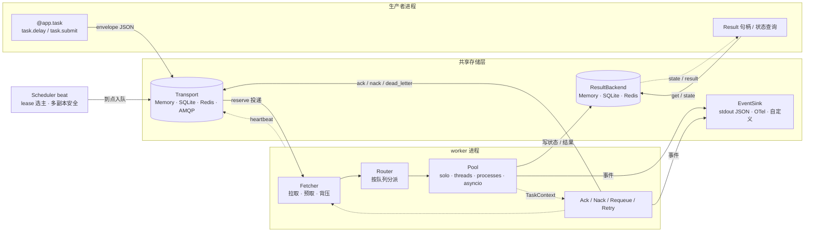
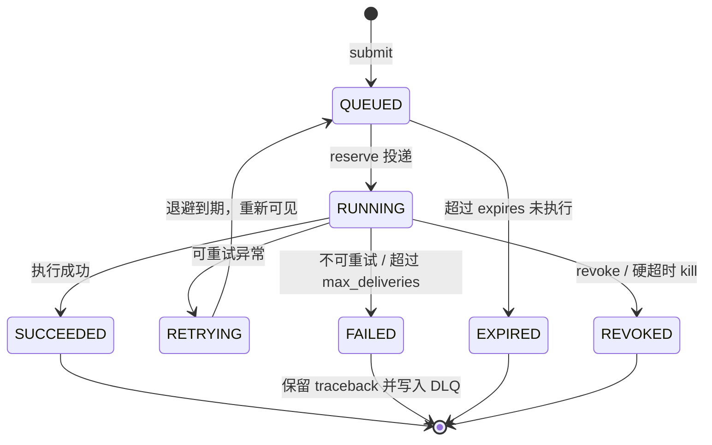
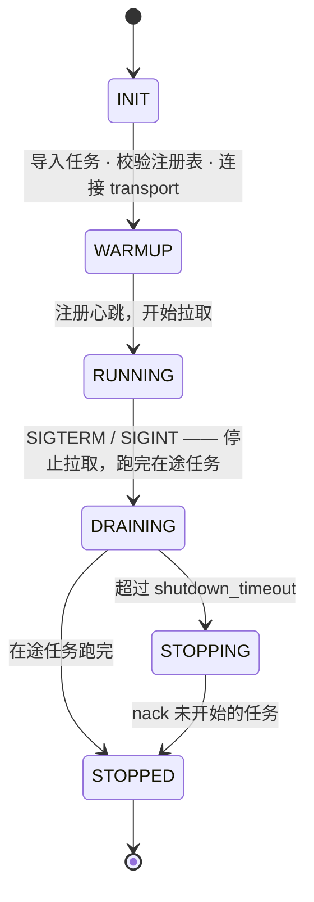

# taskmq 设计文档（v0.1 草案）

> 定位：一个「类 Celery」的 Python 任务队列框架。继承 Celery 的心智模型（task / queue / worker / beat），
> 但重新设计投递语义、配置模型和开发体验，干掉那些让人无语的隐式魔法。
>
> 状态：v0.2。§20 的决策已确认（仅第 7 条工作流优先级为 🟡 暂定）。Phase 0 实现进行中。

---

## 0. 一句话定位

**零外部服务就能跑起来（不需要 Redis / RabbitMQ / 外部 DB）、投递语义可预测、配置显式、调试不用猜的 Python 分布式任务队列。**

~~~python
from taskmq import App, Config, Retry

app = App(Config(transport="sqlite:///./taskmq.db", concurrency=8))

@app.task(queue="email", retry=Retry(max_attempts=5, backoff="exp"))
def send_email(to: str, subject: str) -> str:
    ...

send_email.delay("a@b.com", "hi")   # 生产者侧，不需要 broker
~~~

~~~bash
taskmq worker --queues email,default --concurrency 8   # 消费侧
taskmq dev                                             # 本地一键起 worker + beat
~~~

不需要先装 Redis、不需要先起 RabbitMQ、不需要先写 200 行配置。

---

## 1. 为什么要重写：Celery 的痛点 → 对策

| # | Celery 的坑 | 实际表现 | taskmq 对策 |
|---|---|---|---|
| 1 | 强依赖外部 broker | 本地开发和 CI 都要先起 Redis/RabbitMQ | 内置 **SQLite transport**（WAL + 原子 claim），生产可直接用；内存 transport 用于测试；Redis/AMQP 是可选增强而非前提 |
| 2 | 默认「早 ack」 | worker 被杀 / OOM / 部署重启 → 任务**静默丢失** | 默认 **at-least-once**（成功后才 ack）+ 可见性租约 + 最大投递次数 + DLQ |
| 3 | prefetch 是乘法 | `prefetch_multiplier * concurrency`，长任务被一个 worker 全吞掉，其他 worker 饿死 | `prefetch` 是**绝对值**，默认等于并发数，可 per-queue；语义写进文档 |
| 4 | 配置是懒加载代理 | `app.conf` 读的时候才知道值，拼错 key 不报错 | 单一 **frozen dataclass**，构造即校验，未知字段直接抛错；环境变量前缀显式映射 |
| 5 | autodiscover 隐式 import | 循环导入、配置未就绪就执行模块级代码、任务注册顺序依赖 import 顺序 | **显式** `include=[...]` / `app.discover("pkg")`；导入期零副作用是硬约束 |
| 6 | 两套重试机制 | `self.retry()` 用异常控制流 + `autoretry_for`，语义重叠、容易写出死循环 | 单一 `Retry` 声明式策略 + `ctx.retry()` 手动逃生口，二者语义互补且明确 |
| 7 | canvas 过于复杂 | chain/group/chord 互相嵌套，chord 靠轮询 result backend，出问题没法调 | Phase 2 用**原生 DAG 工作流**替代，调度器直接感知依赖，不走轮询 |
| 8 | 默认允许 pickle | 安全风险和跨版本反序列化灾难 | 默认 **msgspec**（`serializer="json"` 可退回纯标准库），类型白名单注册，pickle 需要显式开启并打警告 |
| 9 | 结果语义混乱 | `ignore_result` / backend 组合爆炸，Redis 里结果永远堆积 | 结果后端是**显式配置的一个对象**，强制 TTL；不配置就只保留轻量状态，不存返回值 |
| 10 | beat 多实例重复触发 / 时区坑 | 部署两个副本就双倍执行；DST 切换时任务漂移 | SQLite/Redis **lease 选主**；`zoneinfo` 显式时区；misfire 策略显式声明 |
| 11 | signals 无类型、难测 | 字符串事件名 + 弱签名，IDE 无补全，测试要全局注册再清理 | 类型化 **hooks + middleware**，可直接实例化测试 |
| 12 | 测试难 | `task_always_eager` 是全局开关，monkeypatch 满天飞 | `MemoryTransport` + `eager=True` + `Worker.run_until_idle()`，确定性、无全局状态 |
| 13 | 版本频繁破坏性变更 | 升级一次改一堆配置项 | 消息协议带 `v`，语义化版本 + 明确兼容窗口，配置字段新增不删除 |

---

## 2. 设计原则

- **P1 零外部服务可运行**：不需要 Redis / RabbitMQ / 外部数据库。core 的唯一第三方依赖是 `msgspec`（默认序列化器，决策 §20-5）；显式配置 `serializer="json"` 时退化为纯标准库路径。
- **P2 显式优于隐式**：路由、并发、重试、序列化、超时全部显式声明；默认值写在文档里且可预测。
- **P3 投递语义可证明**：每条消息处于什么状态、谁持有、何时可见，都是可查询的数据库行，不是内存里的黑盒。
- **P4 失败必须可见**：失败进 DLQ、进事件流、进 CLI，不吞异常、不静默丢任务。
- **P5 单进程开发体验**：`taskmq dev` 一条命令起全套，本地零配置。
- **P6 不做分布式事务**：不承诺 exactly-once；用「at-least-once + 幂等键」把问题还给业务，但把工具给足。
- **P7 小核心 + 明确插拔点**：Transport / ResultBackend / Pool / Scheduler / Serializer 五个接口，其余不抽象。
- **P8 类型友好**：`py.typed`，任务句柄泛型化，`Result[T]` 可被 mypy/pyright 推断。

## 3. 非目标（这一版明确不做）

- 不**默认**提供 Celery 的 drop-in 兼容层：`from celery import ...` 只在显式安装可选包 `taskmq-celery`（Phase 2，决策 §20-8）后可用，默认安装不遮蔽真实的 `celery`。
- 不支持 Python < 3.10（决策 §20-2）。代码不得使用 3.11+ 专有语法/API（`asyncio.timeout`、`TaskGroup`、`ExceptionGroup`、`tomllib`、`typing.Self`、`StrEnum`、`datetime.UTC` 等），确有需要时收敛到 `taskmq/_compat.py`。
- 不做 supervisor / 自动扩缩容 / K8s operator（交给 systemd、K8s、Nomad）。
- 不内置 Web UI（Phase 3 再议）。
- 不默认启用 pickle，不追求「任意对象都能进队列」。

---

## 4. 架构总览

代码分层（依赖只能向下，不能反向）：

~~~
taskmq/
  __init__.py      # 公开 API：App, task, Config, Retry, Result, current_task
  config.py        # frozen dataclass 配置 + 校验 + 环境变量映射
  app.py           # App：注册表、transport/backend/pool 装配
  task.py          # @task 装饰器、TaskHandle、TaskContext、Retry
  protocol.py      # envelope 定义、版本、编解码、大小限制
  transport/
    base.py        # Transport 抽象 + 不变量文档
    memory.py
    sqlite.py
    redis.py       # Phase 1
    amqp.py        # Phase 2
  result/
    base.py  memory.py  sqlite.py  redis.py
  worker/
    runner.py      # 主循环、生命周期、优雅退出
    pool.py        # solo / threads / processes / asyncio
    fetcher.py     # 拉取、预取、背压、per-queue 公平
    hooks.py       # 类型化钩子 + 中间件
  scheduler/
    beat.py        # cron/interval 调度
    lease.py       # 选主
  cli.py           # taskmq worker / beat / dev / status / dlq / call / purge
  testing.py       # fixtures、run_until_idle、时间冻结、故障注入
~~~

---

## 5. 核心概念

| 概念 | 定义 |
|---|---|
| **Task** | 被 `@app.task` 装饰的可调用对象 + 它的静态策略（队列、重试、超时、序列化） |
| **Job** | 一次**逻辑**任务（一个 ULID），可能包含多次投递/尝试 |
| **Delivery** | Job 的一次投递尝试，有独立的 attempt 计数和租约 |
| **Envelope** | 在 transport 中流转的 JSON 消息体 |
| **Queue** | 逻辑队列（名字 + 优先级 + 容量 + TTL），不是 broker 的物理队列 |
| **Worker** | 一个进程，持有 N 个并发槽位，订阅若干队列，定期心跳 |
| **Pool** | Worker 内的执行模型：solo / threads / processes / asyncio |
| **Transport** | 消息的可靠投递层：enqueue / reserve / ack / nack / requeue / dead_letter |
| **ResultBackend** | 返回值与最终状态的持久化层（可选、显式） |
| **DLQ** | 死信队列：超过最大投递次数、不可重试、或过期失败的任务落在这里，可查询可重放 |
| **TaskContext** | 任务运行时的显式上下文对象（attempt、deadline、日志、`ctx.retry()`、`ctx.publish()`） |

---

## 6. 目标开发体验（先写用例，再写实现）

### 6.1 生产者

~~~python
from taskmq import App, Config

app = App(Config(transport="sqlite:///./taskmq.db"))

@app.task(queue="email", timeout=30, retry="default")
def send_email(to: str, subject: str) -> str:
    return f"sent:{to}"

h = send_email.delay("a@b.com", "hi")          # 语法糖
h2 = send_email.submit(                        # 全功能入口
    "a@b.com", "hi",
    queue="email",
    eta=None,                                   # 延迟执行（秒或 datetime）
    expires=3600,                               # 超过 TTL 未执行则丢弃并标记 expired
    timeout=30,
    priority=5,
    key="order-42:email",                       # 幂等键：同 key 在窗口内只执行一次
)
print(h.id, h.state)                            # 立即返回，不阻塞
print(h.get(timeout=10))                        # 需要结果时才阻塞
~~~

### 6.2 消费者（任务实现）

~~~python
from taskmq import task, current_task, Retry

@app.task(queue="email", retry=Retry(max_attempts=5, backoff="exp", jitter=True))
def send_email(to: str, subject: str) -> str:
    ctx = current_task()          # contextvar，显式取用，测试里可直接构造
    ctx.log.info("sending", to=to, attempt=ctx.attempt)
    try:
        return smtp_send(to, subject)
    except TemporaryError as e:
        raise ctx.retry(reason=str(e))          # 交由策略计算退避时间
~~~

### 6.3 CLI

~~~bash
taskmq worker -Q email,default -c 8 --pool threads
taskmq worker -Q heavy -c 4 --pool processes
taskmq beat --schedule taskmq_schedule.py
taskmq dev                                   # worker + beat 同一进程，本地开发
taskmq status                                # worker 列表、队列深度、速率
taskmq dlq list --queue email
taskmq dlq replay --all --queue email
taskmq call myapp.tasks.send_email --args '["a@b.com","hi"]'   # 同步触发一次，方便调试
taskmq purge --queue email
~~~

---

## 7. 公开 API 设计

### 7.1 App

~~~python
app = App(
    Config(
        transport="sqlite:///./taskmq.db",   # 或 "memory://" / "redis://..." / 自定义实例
        result=None,                        # 不配则不存返回值，只保留状态
        default_queue="default",
        concurrency=4,
        pool="threads",
        prefetch=4,                         # 绝对值，不是倍数
        serializer="json",
        timezone="Asia/Shanghai",
    ),
    include=["myapp.tasks"],                # 显式导入任务模块
)
~~~

规则：
- **构造即校验**：字段类型、URL scheme、pool 与任务类型的兼容性全部在 `App()` 时检查，未知配置项直接抛 `ConfigError`。
- **无全局单例**：可以有多个 App（测试里很需要），`current_app()` 只在 task 执行上下文中有效。
- **无模块级副作用**：`import myapp.tasks` 只做函数定义，不建立连接、不读环境变量。

### 7.2 任务定义参数

两种等价写法：`@app.task`（函数式糖）与 **继承 `Task` 基类**（类式，可 mixin、可覆写生命周期钩子）；函数式任务用 `bind=True` 拿到任务实例 `self`，`self.request` 即类型化的 `TaskContext`。
钩子顺序、异常策略、实例生命周期与 Celery 对照见 [tasks.md](design/tasks.md)。

| 参数 | 默认 | 说明 |
|---|---|---|
| `name` | `module.func` | 跨进程唯一标识，必须稳定（改名 = 协议不兼容） |
| `queue` | `default_queue` | 静态路由；也可用 `router` 函数动态决定 |
| `priority` | `0` | 静态默认优先级（**数值越大越优先**）；`submit(priority=…)` 可覆盖；作用域与防饥饿见 [priority.md](design/priority.md) |
| `retry` | `None` | `Retry` 对象或注册表里的名字 |
| `timeout` | `None` | 软超时（协作式 deadline），见 §10.7 |
| `ack` | `"on_success"` | `"on_receipt"` / `"on_success"` / `"on_completion"` |
| `expires` | `None` | 默认 TTL，超时未执行则丢弃 |
| `max_deliveries` | `5` | 超过则进 DLQ，防止毒丸消息无限重投 |
| `rate_limit` | `None` | 如 `"100/m"`，token bucket |
| `concurrency_key` | `None` | 同 key 的任务在集群内串行（如按 user_id 串行） |
| `serializer` | 全局 | 允许 per-task 覆盖 |
| `store_result` | `True` | 若配了 result backend |

### 7.3 状态机

- 状态变更**先写 transport/backend 再产生副作用**，保证崩溃后状态一致。
- `PENDING` 只用于「生产者还没提交成功」或「查询不存在的 id」，不参与正常工作流（消除 Celery 里 PENDING 的歧义）。

### 7.4 Result 句柄

~~~python
h = send_email.delay("a@b.com", "hi")
h.id            # ULID，按时间可排序，便于按时间范围排查
h.state         # 单次读取，不阻塞
h.get(timeout=10)                 # 阻塞取结果；失败抛 RemoteError(含远端 traceback)
await h.aget(timeout=10)          # asyncio 场景
h.wait(timeout=60, poll=0.2)      # 只等状态不取结果
h.revoke(terminate=False)         # 撤销（未执行则直接丢弃）
h.info          # {"attempt": 2, "worker": "w-1", "runtime": 0.31, ...}
~~~

### 7.5 TaskContext

~~~python
ctx.id            # job id
ctx.attempt       # 当前是第几次尝试（从 1 开始）
ctx.deliveries    # 累计投递次数
ctx.queue
ctx.deadline      # 绝对时间；协作式超时用
ctx.remaining()   # 剩余秒数
ctx.log           # 结构化 logger，自动带 job_id / task / attempt
ctx.publish(t, *a, **kw)     # 在任务里派发子任务（不自己建连接）
ctx.retry(reason="")         # 按策略重试，返回要抛的异常
ctx.heartbeat()              # 长任务手动续租，避免被判定为孤儿
ctx.check_cancelled()        # 协作式取消检查点
~~~

---

## 8. 消息协议（Envelope）

~~~json
{
  "v": 1,
  "id": "01HQ8Z9K2M4T6V8X0Z2B4D6F8H",
  "task": "myapp.tasks.send_email",
  "args": ["a@b.com", "hi"],
  "kwargs": {},
  "queue": "email",
  "priority": 0,
  "eta": null,
  "expires_at": null,
  "deadline": null,
  "attempt": 1,
  "max_attempts": 5,
  "ack": "on_success",
  "key": "order-42:email",
  "trace": { "traceparent": "00-...-...-01", "origin": "web-1" },
  "enqueued_at": 1735000000.123,
  "headers": {}
}
~~~

约束：
- `v` 是协议版本，反序列化时按版本分支；不认识的**大版本**直接拒绝并告警，不猜测。
- 消息体默认上限 256 KiB（可配），超限在**生产者侧**就抛错，不等到 broker 炸。
- `args/kwargs` 必须是 JSON 可编码；自定义类型需要 `app.register_codec(Type, encode, decode)`。
- 时间统一用 UTC 时间戳，展示层再转时区。

---

## 9. Transport 抽象

### 9.1 接口

~~~python
class Transport(Protocol):
    def enqueue(self, env: Envelope, *, queue: str | None = None, delay: float = 0.0,
                priority: int | None = None) -> str: ...      # 返回 job id（env.id）
    def reserve(self, queues: list[str], *, worker_id: str, lease: float, limit: int) -> list[Delivery]: ...
    def ack(self, d: Delivery) -> None: ...
    def nack(self, d: Delivery, *, requeue: bool = True, delay: float = 0.0) -> None: ...
    def dead_letter(self, d: Delivery, reason: str) -> None: ...
    def extend_lease(self, d: Delivery, seconds: float) -> None: ...
    # 插队原语（决策 §20-9，见 priority.md §3.3）
    def peek_max_priority(self, queues: list[str]) -> int | None: ...
    def yield_reservation(self, d: Delivery, *, delay: float = 0.0, max_yields: int = 100) -> bool: ...
    def next_visible_at(self, queues: list[str]) -> float | None: ...
    def set_state(self, job_id: str, state: str, **meta) -> JobRecord: ...
    def get_state(self, job_id: str) -> JobRecord | None: ...
    def queue_stats(self, queues: list[str] | None = None) -> list[QueueStat]: ...
    def reap_expired_leases(self, now: float | None = None) -> int: ...   # 孤儿回收
    def reap_expired_jobs(self, now: float | None = None) -> int: ...     # expires
    def close(self) -> None: ...
~~~

> Phase 0 已实现 `base.py` + `memory.py`（`sqlite.py` 是下一步）。

### 9.2 必须成立的不变量

1. 一条消息在任意时刻**至多被一个 worker 持有**（租约保证）。
2. 持有者崩溃且租约到期后，消息**必须**重新可见（除非已 ack）。
3. `ack` 之后消息不可再被任何 worker 看到。
4. `reserve` 返回的消息，其 `attempt/deliveries` 计数已自增。
5. 队列顺序：同优先级下 FIFO；有 `priority` 时高优先级先出（不保证严格公平，除非显式开启）。
6. 所有状态转换都是**幂等**的（重复 ack 不报错）。
7. `reap_*` 可由任意进程并发调用而不产生重复投递。
8. 任何错误都不允许「假装成功」——宁可重投。

### 9.3 内置 SQLite Transport（重点：这是「零依赖」的关键）

~~~sql
PRAGMA journal_mode=WAL;
PRAGMA busy_timeout=5000;
PRAGMA synchronous=NORMAL;

CREATE TABLE messages (
  id           INTEGER PRIMARY KEY AUTOINCREMENT,
  job_id       TEXT    NOT NULL,
  queue        TEXT    NOT NULL,
  task         TEXT    NOT NULL,
  envelope     BLOB    NOT NULL,
  priority     INTEGER NOT NULL DEFAULT 0,
  state        TEXT    NOT NULL DEFAULT 'queued',  -- queued|reserved|acked|dead
  visible_at   REAL    NOT NULL,                   -- eta/退避后的可见时间
  expires_at   REAL,
  claimed_by   TEXT,
  claimed_at   REAL,
  lease_until  REAL,
  deliveries   INTEGER NOT NULL DEFAULT 0,
  last_error   TEXT
);
CREATE INDEX idx_claim ON messages(state, queue, visible_at, priority DESC, id);
CREATE INDEX idx_job   ON messages(job_id);

CREATE TABLE jobs (        -- 轻量状态机 + 可选结果
  job_id      TEXT PRIMARY KEY,
  task        TEXT NOT NULL,
  state       TEXT NOT NULL,
  result      BLOB,
  error       TEXT,
  created_at  REAL NOT NULL,
  updated_at  REAL NOT NULL,
  expires_at  REAL
);

CREATE TABLE workers (     -- 心跳，用于 status 与孤儿判定
  id TEXT PRIMARY KEY, queues TEXT, pool TEXT, concurrency INTEGER,
  started_at REAL, heartbeat_at REAL, meta BLOB
);

CREATE TABLE leases (      -- beat 选主 / 全局互斥
  name TEXT PRIMARY KEY, owner TEXT, expires_at REAL
);

CREATE TABLE idempotency ( -- 幂等键
  key TEXT PRIMARY KEY, job_id TEXT, created_at REAL, expires_at REAL
);
~~~

原子 claim（多 worker 并发安全）：

~~~sql
BEGIN IMMEDIATE;
UPDATE messages
   SET state='reserved', claimed_by=?, claimed_at=?, lease_until=?, deliveries=deliveries+1
 WHERE id = (SELECT id FROM messages
              WHERE state='queued'
                AND queue IN (...)
                AND visible_at <= ?
                AND (expires_at IS NULL OR expires_at > ?)
              ORDER BY priority DESC, id
              LIMIT 1)
RETURNING *;
COMMIT;
~~~

实现要点：
- `enqueue` 用独立短事务，避免长事务阻塞 writer。
- 空闲时轮询退避：0.05s → 0.5s（可配上限），有积压时立刻回落到最小值。
- **吞吐预期**：SSD + WAL 下 enqueue ≈ 3k–10k msg/s，claim ≈ 1k–3k msg/s（单文件单 writer）。
  超过这个量级请上 Redis transport。文档必须写明这条边界，不做「什么都能扛」的承诺。
  实测（本机 M 系列 SSD、单连接、小载荷、每消息 1 次 reserve + 1 次 ack）：
  **enqueue ≈ 11.3k msg/s，claim+ack ≈ 4.6k msg/s**；端到端吞吐由 worker 的 poll 间隔与任务本身决定
  （验收里的 1000 任务 7.3s 主要是 `run_until_idle` 的 50ms 轮询等待，不是 SQL 瓶颈）。
- 多进程共享同一个 db 文件是支持的一等场景（worker 部署在同一台机器 / 共享盘）。
  跨主机（决策 §20-6）：一期只覆盖**同机多进程**与**共享盘（NFS/SMB，需可靠的 POSIX 文件锁）**；
  跨主机高吞吐请用 `redis://`（Phase 1）或 `postgres://`（Phase 2）。
  对象存储（`oss://` / `s3://`）**不作为一期 transport**：即便对象存储提供条件写类原语，每次 reserve 仍需
  额外的租约对象 + 轮询/长轮询，延迟与请求成本都不适合放在热路径；定位为 Phase 2+ 的低频/归档队列候选。

### 9.4 其他 Transport

| Transport | 阶段 | 用途 |
|---|---|---|
| `memory://` | Phase 0 | 单测、`eager` 模式、本地试跑 |
| `sqlite://` | Phase 0 | 零依赖默认、单机生产 |
| `redis://` | Phase 1 | 高吞吐、原生阻塞弹出（BRPOP/BZPOPMIN） |
| `postgres://` | Phase 2 | 已经有 PG 的团队：SKIP LOCKED + LISTEN/NOTIFY |
| `amqp://` | Phase 2 | 需要路由/联邦的场景 |

---

## 10. Worker 运行时

### 10.1 生命周期

- `SIGTERM`/`SIGINT` 触发优雅退出；`shutdown_timeout`（默认 30s）后可被 SIGKILL。
- 未开始执行的消息**立即 nack 回队**，不留在内存里丢。
- 启动时校验：本 worker 注册表里缺失的 task 名 → 启动即失败（提前发现部署不一致），而不是运行时才报错。

### 10.2 执行池

| Pool | 适用 | 说明 |
|---|---|---|
| `solo` | 调试 | 同步顺序执行，异常直接冒到终端 |
| `threads` | IO 密集（**默认**，决策 §20-3） | 轻量、共享内存；**无法强杀**，超时只能协作式 |
| `processes` | CPU 密集 | ✅ 真隔离、可强杀、可硬超时；任务参数必须可序列化。**硬超时任务**每次投递起一个独立子进程（超时 `terminate/kill`），其余任务走 `ProcessPoolExecutor` 复用子进程；子进程需要 `app_spec`（`--app module:attr` / `TASKMQ_APP`）重建 App |
| `asyncio` | 任务本身是 `async def` | ✅ 单事件循环 + 线程槽位：`async` 任务体在 loop 上 `await`，同步任务体在池线程里跑；状态写入/ack/钩子都不占 loop |

- 混用：`async def` 任务在 threads/processes 池里会被明确拒绝（**启动即 `ConfigError`**），不做隐式 `asyncio.run()`。
- 预 fork：processes 池的普通任务复用 `ProcessPoolExecutor` 的子进程；**声明 `hard_timeout` 的任务**为了可强杀，
  每次投递起独立子进程（macOS spawn 约 0.2–0.4s）——所以 processes 池适合 CPU 密集的**长任务**，海量小任务用 threads。
- `hard_timeout` 在非 processes 池只**告警**不报错（threads 无法强杀，§10.6）。

### 10.3 拉取、预取与背压

- `prefetch` 是**绝对值**（默认 = concurrency），是「本 worker 最多同时持有多少条未 ack 消息」。
- **reserve–start 耦合**：只在真有**空闲执行槽位**时才 reserve，池内队列有界。否则「预取占着槽位但活还没开始」会挡住紧急任务（决策 §20-9）。
- **让位（yield）**：更高优先级消息可见时，**未开始**的预留必须交回队列（`yields` 独立计数，不计入 `deliveries`）；**正在执行的永不打断**。详见 [priority.md](design/priority.md) §3。
- 每个队列独立配额，避免一个大队列把 worker 的所有槽位占满（Celery 的经典队头阻塞）。
- 传输层不可用 → 指数退避重连，worker 保持存活并上报状态，不 panic 退出。
- 内存水位保护：当 `len(inflight) >= prefetch` 时停止 reserve。

### 10.4 孤儿回收与心跳

- ✅ 已实现：worker 每 `min(heartbeat_interval, lease/3)`（下限 50ms）续租**在途**任务的租约。
  没有这一步，跑得比 `lease` 还久的任务会被**自家 reap 判成孤儿并重投**——at-least-once 下就是重复执行
  （实测：lease=0.3s 的 1s 任务被重投 14 次后超时；`tests/test_acceptance.py::test_long_running_task_lease_is_renewed` 守住）。
- ⏳ 待办：`workers` 表心跳与 `taskmq status` 的 worker 列表（CLI 目前只显示队列深度）。
- 租约默认 `lease = timeout * 2 + 30s`；任何进程都可以调用 `reap_expired_leases()`（幂等，用 `UPDATE ... WHERE state='reserved' AND lease_until < ?` 实现），把死掉 worker 的消息重新可见。
- 超过 `max_deliveries` 的消息进 DLQ，并记录 `last_error` 和 `claim history`。

### 10.5 速率限制与并发键

- `rate_limit="100/m"`：**worker 内** token bucket（桶初始满，允许突发 = limit）；超限时用
  `transport.defer()` 把消息放回队列——**defer 不消耗 `deliveries`**，所以被限流反复推迟的任务
  不会被毒丸保护误送 DLQ。跨 worker 的分布式限流仍属 Phase 2。
- `concurrency_key="user:{user_id}"`（模板在 **submit 时**用任务 kwargs 渲染，渲染失败即 `ConfigError`）：
  同 key 任务在集群内串行。实现是 transport 的**命名租约**（`acquire_lease/release_lease/renew_lease`，
  SQLite 落在 `leases` 表、memory 在进程内），拿不到就 defer 稍后再来。
  租约 TTL = `max(lease, task.timeout + 30s)`，worker 猝死也能自动释放。
  注意：租约 owner 是 worker_id，所以**同一 worker 内的自查必须与获取原子**（`Worker` 用一把锁
  保护 `_held_keys`），否则同 worker 的多个线程会互相「自认持有」而并发跑起来。这是 Celery 完全没有的能力。

### 10.6 超时（三层，语义写清楚）

| 类型 | 机制 | 可靠性 |
|---|---|---|
| 软超时 `timeout` | 注入 `ctx.deadline`，任务需要自行检查或通过 `ctx.remaining()` 控制 | 协作式，依赖任务配合 |
| 硬超时 `hard_timeout` | ✅ 已实现：processes 池超时直接 `terminate/kill` 子进程，任务按策略重试或进 DLQ；threads/solo/asyncio 池**不支持**（启动时警告）。被 kill 的任务**不会**执行 `on_failure`/`on_retry`/`after_return`（进程已经没了） | 强可靠（仅进程池） |
| 取消 `revoke(terminate=True)` | processes 池 kill；否则等任务自己结束 | 同上 |

不承诺「线程池也能硬超时」——Celery 的 soft/hard time limit 正是这里最容易让人误判的地方。

### 10.7 优雅退出的时序

1. 收到信号 → 停止 `reserve`。
2. 对已 reserve 但未开始的消息 `nack(requeue=True)`。
3. 等待在途任务至多 `shutdown_timeout`；期间每 `heartbeat` 续租。
4. 完成任务正常 ack；未完成的保持租约到期后自动重投。
5. 注销 worker 记录，退出。

---

## 11. 执行语义

### 11.1 Ack 策略

| 策略 | 语义 | 适用 |
|---|---|---|
| `on_receipt` | 拿到就 ack，崩溃即丢 | 可丢的埋点/指标 |
| `on_success`（默认） | 成功才 ack，失败/崩溃会重投 | 绝大多数任务 |
| `on_completion` | 无论成败都 ack（失败进 DLQ，不重投） | 不希望重试的写操作 |

### 11.2 重试

~~~python
Retry(
    max_attempts=5,
    backoff="exp",          # "fixed" | "linear" | "exp"
    base=1.0, factor=2.0, max_delay=600,
    jitter=True,            # 全抖动，防惊群
    retry_on=(TemporaryError, TimeoutError),   # 白名单；其余异常不重试
)
~~~

- `delay = min(max_delay, base * factor ** (attempt - 1)) * uniform(0.5, 1.5)`
- 重试通过**重新入队 + `visible_at`** 实现，不在 worker 内部 sleep（sleep 会占住并发槽位，Celery 的常见事故）。
- **非白名单异常默认不重试**，直接 FAILED → DLQ。避免 Celery 里「不小心把所有 bug 重试 3 次」。
- 重试次数用尽 → DLQ，带完整的失败历史。

### 11.3 幂等

- `task.submit(..., key="order-42:email")`：transport 在 `idempotency` 表内做原子插入。
  插入成功 → 正常入队；冲突且未过期 → 返回**已存在 job 的句柄**（不重复执行）。
- TTL 默认 24h，可配。key 只在窗口内去重，文档明确说明**不是** exactly-once。

### 11.4 过期

- `expires` 到期仍未开始执行 → 标记 `EXPIRED`，不执行、进事件流；仍在执行的任务不被中断（除非配了硬超时）。

### 11.5 失败分类

| 分类 | 行为 |
|---|---|
| 可重试（白名单） | RETRYING → 退避重投 |
| 不可重试（其他异常） | FAILED → DLQ，保留 traceback |
| 致命（协议/编码/注册表错误） | 直接 DLQ + 告警，不重试不重投 |
| 过载（队列满） | 生产者侧阻塞或抛 `QueueFull`（可配） |

### 11.6 序列化

- 默认 **`msgspec`**（决策 §20-5，速度优先、类型更严格）。`serializer="json"` 退回标准库 `json`，纯标准库可运行。
- 注册自定义类型：`app.register_codec(Money, encode=..., decode=...)`，未知类型在**编码时**报错。
- 反序列化只允许白名单类型，禁止 `__reduce__` 之类的路径。
- `pickle` 需显式开启且启动时打警告（Phase 2 再评估是否移除）。

---

## 12. Result 后端

~~~python
Config(result="sqlite:///./taskmq.db", result_ttl=3600)
~~~

- **默认不存返回值**：只要状态。需要 `h.get()` 才配 backend，且必须给 `result_ttl`（无 TTL 会被拒绝）。
- 接口：`set_result / get_result / set_state / get_state / forget(job_id)`。
- 失败信息包含远端 traceback 字符串，`h.get()` 抛 `RemoteError`（保留 `__cause__` 语义之外的原始 traceback 文本）。
- **不要拿 backend 当队列**：明确写进文档。工作流依赖走调度器（Phase 2），不靠轮询 backend。
- TTL 清理由任意进程的 `reap` 顺带完成，不需要额外守护进程。

---

## 13. 调度器（beat）

~~~python
from taskmq.schedule import cron, every

app.schedule(
    cron("send_daily_report", "0 9 * * *", tz="Asia/Shanghai"),
    every("cleanup", seconds=300, args=[]),
)
~~~

- 独立进程 `taskmq beat`，也可 `taskmq dev` 与 worker 合并（仅开发）。
- **选主**：所有 beat 副本抢 `leases` 表的 `__beat__` 行，租约 30s 自动续期；抢占失败者进入待命。多副本部署不会重复触发（Celery beat 的经典坑）。
- **misfire 策略**显式声明：`skip`（默认，错过了就跳过）/ `run_once`（补一次，不补一堆）。
- 时区用 `zoneinfo`，cron 按本地时区计算，DST 边界行为单测覆盖。
- 调度定义可以放代码里（`app.schedule`），也可以放 `taskmq_schedule.py` 由 `taskmq beat --schedule` 加载（生产推荐代码化，可 review、可测试）。

---

## 14. 可观测性

### 14.1 事件（结构化，默认输出 JSON 到 stdout）

| 事件 | 关键字段 |
|---|---|
| `task.submitted` | job_id, task, queue, key |
| `task.started` | job_id, worker, attempt, queue |
| `task.succeeded` | job_id, runtime, attempt |
| `task.failed` | job_id, error_type, error, attempt, will_retry |
| `task.retrying` | job_id, next_visible_at, attempt |
| `task.dropped` | job_id, reason（expired/revoked/max_deliveries） |
| `queue.depth` | queue, pending, inflight, dead（周期采样） |
| `worker.heartbeat` | worker, inflight, queues, concurrency |
| `transport.error` | op, error, retry_in |

- 所有事件都带 `job_id` 和 `trace`，可与 OpenTelemetry 的 traceparent 串起来。
- OTel 集成是可选适配器（`taskmq[otel]`），不是 core 依赖。

### 14.2 CLI 状态

~~~bash
$ taskmq status
WORKERS
  w-1  ip 10.0.0.3   queues email,default  pool=threads  inflight=3/8  last_hb 2s ago
QUEUES
  email    pending=120  inflight=3  dead=4   rate=52/s
  default  pending=0    inflight=0  dead=0   rate=0/s
BEAT
  leader w-1, next: send_daily_report in 3h12m
~~~

### 14.3 日志

- 结构化 JSON，字段固定：`ts, level, event, job_id, task, attempt, worker, queue, msg`。
- `ctx.log` 自动注入上下文；本地开发可切 `--log-format=pretty`。

---

## 15. 配置模型

~~~python
@dataclass(frozen=True, slots=True)
class Config:
    transport: str = "memory://"
    result: str | None = None
    result_ttl: int | None = None
    default_queue: str = "default"
    queues: dict[str, QueueConfig] = field(default_factory=dict)
    concurrency: int = 4
    pool: Literal["solo", "threads", "processes", "asyncio"] = "threads"
    prefetch: int | None = None            # None = concurrency
    lease: float = 60.0
    heartbeat_interval: float = 10.0
    shutdown_timeout: float = 30.0
    serializer: Literal["json", "msgspec"] = "msgspec"
    max_message_bytes: int = 256 * 1024
    timezone: str = "UTC"
    log_format: Literal["json", "pretty"] = "json"
    poll_interval: float = 0.05
    max_poll_interval: float = 0.5
    eager: bool = False
~~~

- 环境变量：`TASKMQ_TRANSPORT`、`TASKMQ_CONCURRENCY` …（`TASKMQ_<UPPER_FIELD>`），显式列出，不做通配魔法。
- 优先级：显式参数 > 环境变量 > 默认值。没有配置文件、没有 `app.conf.update()`。
- `Config.validate()` 在 App 构造时执行：URL 合法性、pool 与任务类型兼容、result 必须有 TTL、`concurrency>=1` 等。

---

## 16. 测试与本地开发

~~~python
from taskmq.testing import worker_for

def test_eager_logic():
    app = App(Config(transport="memory://", eager=True))

    @app.task
    def add(a: int, b: int) -> int:
        return a + b

    h = add.delay(1, 2)
    assert h.state == "SUCCEEDED" and h.get() == 3

def test_retry_then_success():
    app = App(Config(transport="memory://"))
    with worker_for(app) as w:                # 线程池 worker，跑在当前进程
        h = flaky.delay()
        w.run_until_idle(timeout=5)           # 确定性：跑空就返回
        assert h.state == "SUCCEEDED"
        assert h.info["attempt"] == 2

def test_worker_crash_redelivery():
    # 故障注入：在第 2 次 attempt 时模拟 worker 崩溃
    with worker_for(app, fail_at={"flaky": 2}) as w:
        ...
    # 断言消息被重新投递，且进 DLQ 前只跑 max_deliveries 次
~~~

- `eager=True`：`delay()` 同步执行，用于纯逻辑单测。
- `worker_for(app)`：真实跑完整链路（transport → pool → ack），但全在进程内，可断点调试。
- **时间冻结**：`freeze_time` 支持，测 ETA/退避/过期不用 sleep。
- **故障注入**：崩溃、transport 报错、ack 失败，都要有一等公民的测试辅助。
- 目标：**框架自身测试覆盖率 ≥ 90%，且所有并发/崩溃场景用确定性测试而非「睡 2 秒碰运气」**。
- 工具链用 **uv**：`uv sync` → `uv run pytest`；`make check` = ruff + mypy + pytest；`.python-version` 固定 3.10（最低支持版本，真机验证）。

---

## 17. 失败模式矩阵（我要的行为）

| 场景 | 期望行为 |
|---|---|
| worker 被 SIGKILL | 租约到期后消息重新可见；`deliveries` +1；超限进 DLQ |
| worker 优雅退出 | 未开始的 nack 回队；在途的跑完再退 |
| transport 短暂不可用 | worker 保持存活、指数退避重连、持续上报状态 |
| transport 长时间不可用 | 生产侧可配「阻塞」或「抛 QueueFull」；绝不静默丢弃 |
| 任务超时（进程池） | kill 进程 → 可重试则重试 → 否则 DLQ |
| 任务超时（线程池） | 只能协作式；启动时明确警告此组合的限制 |
| 反序列化失败 | 消息直接进 DLQ，附带原始字节，不 crash worker |
| 任务名不存在 | worker 启动时校验失败（fail fast） |
| 队列积压 | `queue.depth` 事件 + CLI 可见；可选告警钩子 |
| 结果后端不可用 | 任务本身**照样执行**（业务结果 > 结果记录），后端错误只记事件 |
| 重复投递 | 幂等键去重；没有 key 的任务要求业务自己幂等（文档写明） |

---

## 18. 与 Celery 对照速查

| 能力 | Celery | taskmq |
|---|---|---|
| 本地跑起来 | 需要 broker | 需要 0 个外部服务 |
| 默认投递语义 | 收到即 ack（可能丢） | 成功才 ack（可能重） |
| prefetch | 倍数（反直觉） | 绝对值 |
| 配置 | 懒加载全局 conf | frozen dataclass，构造即校验 |
| 任务发现 | autodiscover 魔法 | 显式 include |
| 重试 | 两套机制 | 一套声明式 + 一个手动入口 |
| 结果后端 | 语义组合爆炸 | 显式对象 + 强制 TTL |
| 多 beat | 会重复触发 | lease 选主 |
| 死信队列 | 需自己搭 | 内置 + CLI 重放 |
| 按 key 串行 | 无 | `concurrency_key` |
| 结构化事件 | 需 flower/自建 | 内置 JSON 事件 + OTel 适配 |
| 测试 | 全局 eager 开关 | memory transport + worker_for |
| 类型提示 | 弱 | py.typed + 泛型 Result |

---

## 19. 里程碑

### Phase 0 — 可用的 MVP（先跑通闭环）✅ **完成**

- [x] `Config` / `App` / `@task` / `TaskHandle` 公开 API
- [x] **类式任务 + 生命周期钩子 + `bind=True`**：`Task` 基类、`app.register()`、`base=`、`bind=True`（`self` / `self.request`）、五个钩子（设计 [tasks.md](design/tasks.md)，T1–T11 全部 ✅）
- [x] `MemoryTransport`（原子 claim、租约、孤儿回收、DLQ、幂等键）
- [x] `SqliteTransport`：WAL + `BEGIN IMMEDIATE` 原子 claim、优先级定档 + 档内按 weight 轮询、`yields`/`yieldable` 让位、DLQ、幂等键、结果/meta 持久化
- [x] `threads` + `solo` 池
- [x] 默认 at-least-once、`Retry` 策略、DLQ
- [x] **优先级插队**：全局严格优先 + 未开始预留让位（`yields` 独立计数）（决策 §20-9）；`status --by-priority` 已可用
- [x] 协议 v1：默认 msgspec 编解码，`serializer="json"` 可切
- [x] CLI：`taskmq worker [-Q] [-c] [--once]` / `status [--by-priority]` / `dlq list|replay` / `call`（入口 `taskmq`，`--app module:attr` 或 `TASKMQ_APP`）
- [x] `taskmq.testing`：`eager` + `worker_for` + `run_until_idle`
- [x] 质量门：Python **3.10** 上 `ruff` + `mypy` + `pyright` + **55 个测试**全绿（协议 / 两个 transport 不变量 / G1·G2·G3 插队 / 任务类与钩子 / CLI / 验收）
- [x] **验收（全部达成）**：无 Redis 环境下 **1000 任务 × 2 个 App/worker** 跑完且**无重复执行** ✔；
      worker 进程被 **`os._exit(9)` 真杀掉**后租约到期消息重新可见并被重新执行（`deliveries==2`）✔；
      超过重试上限进 DLQ 且可重放（重放后 `attempt` 归 1 重新开始）✔；紧急任务在 claim 时插队 ✔。
      见 `tests/test_acceptance.py`。

### Phase 1 — 生产可用

- [x] `processes` / `asyncio` 池 + 硬超时：`ProcessPool`（硬超时任务独立子进程可强杀，其余复用进程池）
      / `AsyncPool`（单事件循环 + 线程槽位）；async 任务与非 asyncio 池的混用在启动期 `ConfigError`
- [ ] `RedisTransport` + `RedisResultBackend`（本机无 redis-server，需在有服务的环境验证）
- [ ] `beat` + lease 选主 + misfire 策略（`leases` 原语已就绪）
- [x] 幂等键（Phase 0）、`concurrency_key`、`rate_limit`：命名租约 + token bucket + `defer`（不消耗 `deliveries`）
- [x] 结构化事件：`Config.events`（stdout/null）+ `EventSink` 协议 + `CollectingSink`；事件含
      `task.submitted/started/succeeded/failed/retrying/deferred`（OTel 适配器待补）
- [ ] 覆盖率 ≥ 90%，崩溃场景确定性测试
- **验收**：单机 4 worker × 8 并发压测达标；双 beat 副本无重复触发。

### Phase 2 — 进阶

- [ ] 原生 DAG 工作流（替代 chain/group/chord）🟡 暂定放这里（§20-7）
- [ ] `postgres://` transport（SKIP LOCKED）、`amqp://`
- [ ] 分布式限流、优先级公平调度
- [ ] 任务级中间件（审计、多租户、权限）
- [ ] **Celery 兼容层**（§20-8）：可选包 `taskmq-celery`，提供 `celery` 命名空间 shim（`Celery`、`shared_task`、`delay`/`apply_async`、`Retry`、`chain/group/chord` → DAG 映射），存量项目渐进迁移

### Phase 3 — 生态

- [ ] Web UI（只读看板 + DLQ 操作）
- [ ] 插件入口（`taskmq.transport` entry point）
- [ ] Celery 任务迁移工具（AST 级重写辅助）

---

## 20. 决策清单（✅ 已定 / 🟡 暂定 / ❓ 待拍板）

| # | 决策点 | 结论 |
|---|---|---|
| 1 | 包名 | ✅ **`taskmq`** —— `pymq`、`taskq`、`workq`、`pyq`、`taskkit`、`jobkit` 等在 PyPI 已被占用，`taskmq` 可用；import 名与发行名统一 |
| 2 | 最低 Python 版本 | ✅ **3.10+**（`match`、`dataclass(slots=True)`、`X \| Y`、`zip(strict=)`；不使用 3.11+ 的 `asyncio.timeout` / `TaskGroup` / `ExceptionGroup` / `tomllib`） |
| 3 | 默认执行池 | ✅ **`threads`**；CPU 密集显式切 `processes`；`async def` 任务强制 `asyncio` 池 |
| 4 | 默认投递语义 | ✅ **at-least-once**（成功才 ack）+ 可见性租约 + `max_deliveries` + DLQ；不承诺 exactly-once，重复用 `key` 幂等 |
| 5 | 默认序列化 | ✅ **`msgspec`**（core 唯一第三方依赖）；`serializer="json"` 退回纯标准库 |
| 6 | SQLite 跨主机 | ✅ 一期只支持**同机多进程 + 共享盘（NFS/SMB）**；跨主机走 Redis（Phase 1）/ PG（Phase 2）；对象存储（OSS/S3）**不做一期 transport**，列为 Phase 2+ 候选 |
| 7 | 工作流优先级 | 🟡 **暂定：Phase 0/1 只做单任务，DAG 放 Phase 2**（本轮未回复，按建议执行，可随时改） |
| 8 | Celery 兼容层 | ✅ **做**，但不是默认 drop-in：可选包 `taskmq-celery` 提供 `celery` 命名空间 shim，Phase 2 交付，便于存量项目快速切换 |
| 9 | 优先级语义 | ✅ **方案 D**：全局严格优先 + **未开始预留让位**（`yields` 独立计数）+ 平级队列轮询。G1 空闲即最高 / G2 未开始让位 / G3 不打断运行中；数值域 `-9..9`；aging 与兜底 Phase 2。详见 [priority.md](design/priority.md) §10（P1–P19） |

> 相对 v0.1 的变化：Python 下限 3.11 → 3.10；序列化默认 stdlib json → msgspec（P1 相应改为「零外部服务」）；Celery 兼容层从「明确不做」→ Phase 2 可选 shim。

---

## 21. 下一步

1. ✅ 优先级设计已定稿：[priority.md](design/priority.md) v1.0（P1–P19 全部 ✅ = 方案 D + 让位）。
2. ✅ §20 决策已确认（仅第 7 条工作流优先级为 🟡 暂定）。
3. ✅ **Phase 0 完成**：`protocol` / `transport.base` / `transport.memory` / `transport.sqlite` / `App` / `Task`（类式 + `bind=True` + 钩子）/ `Worker`（含 G1–G3 插队）/ `testing` / `cli` 全部落地，**Python 3.10 上 `make check`（ruff + mypy + pyright + 55 测试）全绿**。
4. 🚧 Phase 1 进行中：`concurrency_key`/`rate_limit`、`结构化事件`、**`processes`/`asyncio` 池 + 硬超时**
   已完成；下一步 `beat` 选主（`leases` 已就绪，还差 cron 解析）、Redis transport、OTel 适配、覆盖率 ≥ 90%。
4. 🚧 分册拆分：已落地 `priority.md`；`protocol.md` / `transport.md` / `worker.md` / `scheduler.md` / `testing.md` 待拆。

> 文档版本 v0.2（2025）· 所有设计取舍以「可预测、可调试、失败可见」为最高优先级。
> 分册：[**priority.md**](design/priority.md)（已定稿 v1.0）· [**tasks.md**](design/tasks.md)（草案，待拍板 T1–T8）；待拆：`protocol.md` / `transport.md` / `worker.md` / `scheduler.md` / `testing.md`。
